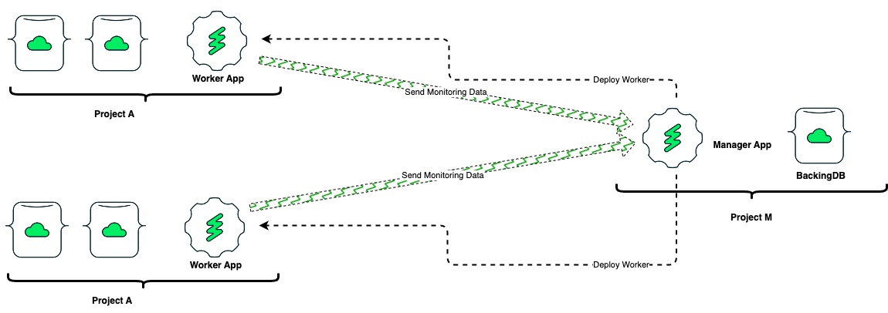
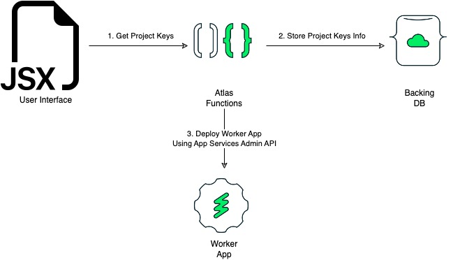

# GlobeTrotter

When I kickstarted the repository to bring this architecture to life, the first thing was to choose the right name. As I imagined the data traveling from multiple Atlas projects into a single place, it felt like a person taking a journey across the world. Hence the name GlobeTrotter.

GlobeTrotter has a WebUI which allows the user to fill some key details like the Project ID and public + private keys that will be used by the backend to perform other tasks in the project.

## Architecture

## Manager App Architecture

## Repo Structure

- gtmanager (Manager App)
  - backend
  - ui
- gtcrawler (Worker App)

## Tech Stack

- NextJS App deployed on Vercel (Manager UI)
- Atlas Charts Embedding SDK for visualisation of metrics
- Serverless NodeJS app deployed on Atlas App Services
- MongoDB Atlas Clusters

## RoadMap

Work in Progress
